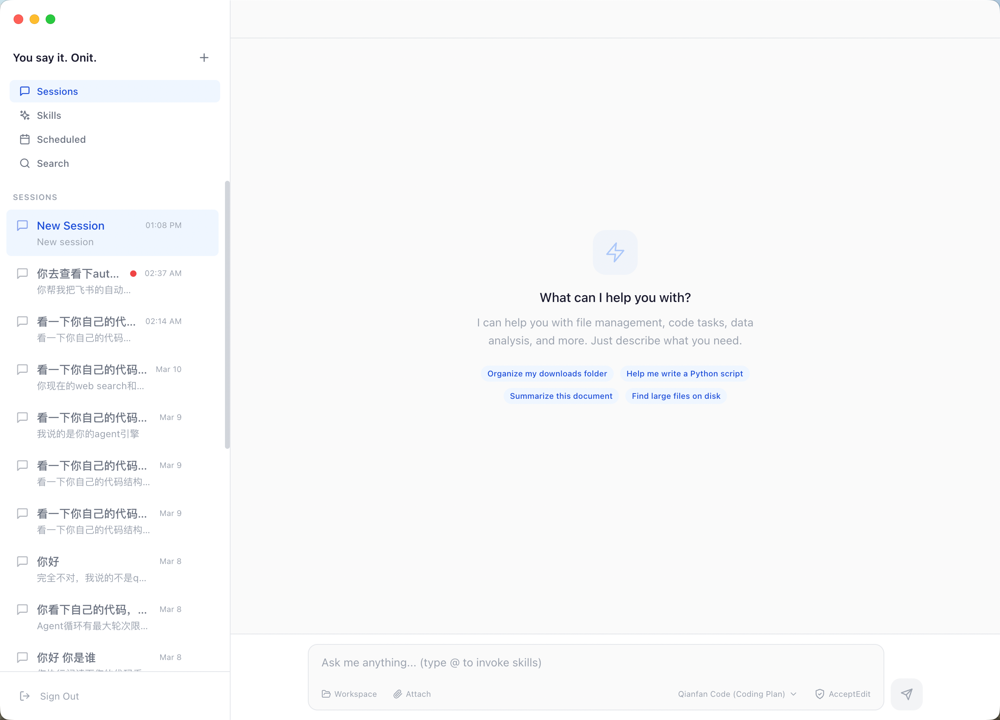
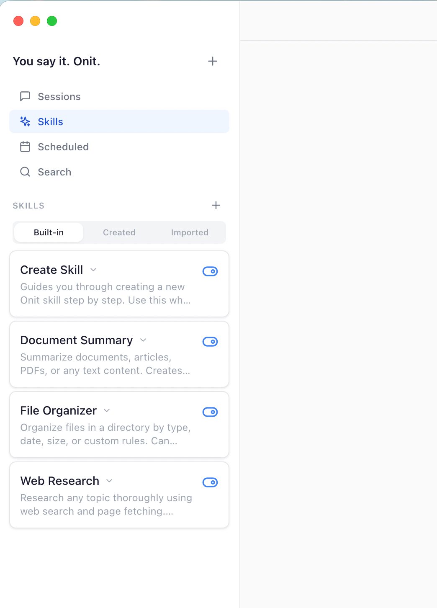
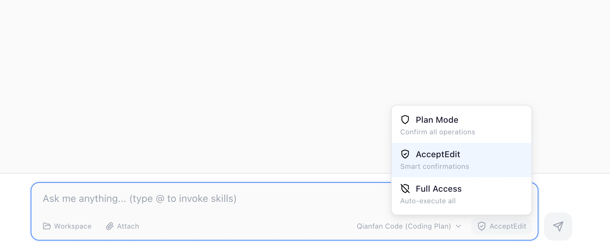

# Onit — You say it. Onit.

> 你的桌面搭档，随时待命。把琐碎的小任务交给 Onit，你专注重要的事。
>
> Your desktop companion, always ready. Hand off small tasks to Onit, so you can focus on what matters.

**[下载 / Download →](https://github.com/lzxfhc/onit/releases/latest)** macOS Apple Silicon (M1+) / Windows x64

[中文](#中文) | [English](#english)

---

<a id="中文"></a>

## 这是什么？

**Onit** 是一款桌面 AI Agent 应用——不是回答问题的聊天框，是能读文件、写代码、搜网页、跑命令的**执行者**。你描述目标，它自己想办法、动手做、做完汇报。

<p align="center">
  
</p>

### 核心亮点

- **自主执行** — 说目标就行，不用一步步教。自己读文件、写代码、搜网页、跑命令
- **Skills 系统** — 可定制的能力模块。内置、自建、导入，用 `@` 一键调用
- **Skill Memory** — 每个 Skill 都有记忆，用得越多越懂你。自动学习你的偏好、项目上下文、工作习惯
- **多模型服务切换** — 支持百度千帆、火山方舟、阿里百炼等主流服务商，一键切换，也支持自定义 API
- **安全护栏** — 文件访问权限隔离 + 三级操作权限模式，为 Agent 装上护栏，每一步可见可控
- **本地部署** — 支持本地模型推理框架（llama.cpp），数据完全在本地处理，100% 隐私安全
- **定时任务** — 设一次，自动跑。支持多种执行频率，无人值守的自动化

## 功能详解

### Skills 系统

给 Agent 装上不同的"技能包"。内置网络调研、代码审查、文档总结等 Skill，也可以用自然语言创建自己的 Skill。

<p align="center">
  
</p>

### Skill Memory — 越用越懂你

每个 Skill 拥有独立的记忆。Onit 在使用过程中自动记录交互数据，后台分析你的偏好、项目特征、工具使用模式，提炼成结构化知识。下次调用时，Skill 自然就"记得"怎么更好地为你工作。

进化过程完全透明——你可以查看 Onit 学到了什么、基于什么证据，觉得合理就应用，不满意就拒绝，还能回滚到任意历史版本。

### 多模型服务

<p align="center">
  
</p>

- **Coding Plan** — 百度千帆、火山方舟、阿里百炼，一键切换
- **API Call** — ERNIE 4.5、DeepSeek V3/R1 等，支持自定义 API 地址
- **本地模型** — Qwen3.5 系列，支持离线运行，按平台自动使用可用加速后端

### 三级权限模式

<p align="center">
  
</p>

| 模式 | 行为 | 适用场景 |
|------|------|---------|
| **Plan** | 每步操作都先问你 | 了解 Agent 工作方式时 |
| **AcceptEdit** | 安全操作自动执行，敏感操作需确认 | 日常推荐 |
| **Full Access** | 全自动执行 | 完全信任的任务 |

文件操作有路径隔离保护，危险命令自动拦截，为 Agent 能力装上安全护栏。

### 定时任务

设置周期性任务（每小时 / 每天 / 每周 / 工作日），Onit 按时在后台执行。打开电脑，结果已经在那了。

## 技术栈

| 层级 | 技术 |
|------|------|
| 运行时 | Electron 35 (Node.js 22) |
| 前端 | React 18 + TypeScript + Tailwind CSS 3 |
| 状态管理 | Zustand |
| 构建 | Vite 5 + electron-builder |
| 本地推理 | node-llama-cpp v3（按平台使用 CPU / Metal / Vulkan / CUDA） |
| LLM API | 千帆 / 火山方舟 / 百炼 / 自定义 |
| 国际化 | 中文 / English |

## 下载安装

### macOS (Apple Silicon)

> **[下载最新版 Onit DMG](https://github.com/lzxfhc/onit/releases/latest)**

1. 从 [Releases](https://github.com/lzxfhc/onit/releases) 页面下载 `Onit-x.x.x-arm64.dmg`
2. 双击 `.dmg` 挂载，将 Onit 拖入 Applications 文件夹
3. 首次打开：右键 Onit → **打开**，然后在系统设置 → 隐私与安全性 → **"仍要打开"**

> ⚠️ 应用未签名，macOS 会弹出安全提示，按上面步骤操作即可。

### Windows (x64)

> **[下载最新版 Onit Windows 包](https://github.com/lzxfhc/onit/releases/latest)**

1. 从 [Releases](https://github.com/lzxfhc/onit/releases) 页面下载 Windows x64 版本压缩包并解压
2. 进入解压后的目录，双击 `install-onit.bat` 自动安装
3. 如果只想免安装运行，也可以直接双击 `Onit.exe`

## 本地开发

```bash
# 安装依赖
ELECTRON_MIRROR=https://npmmirror.com/mirrors/electron/ npm install

# 开发模式（热更新）
npm run dev

# 构建 macOS
npm run build:mac

# 构建 Windows
npm run build:win
```

## 项目结构

```
electron/                    # Electron 主进程
├── main.ts                  # 应用生命周期、IPC、数据目录
├── preload.ts               # Context Bridge
├── agent/
│   ├── index.ts             # AgentManager — ReAct 循环、LLM 流式调用
│   ├── tools.ts             # 9 种内置工具 + 权限分级
│   ├── skills.ts            # Skills 加载与管理
│   ├── skill-evolution.ts   # Skill Memory 自进化引擎
│   └── scheduler.ts         # 定时任务调度
└── local-model/
    ├── index.ts             # 本地模型下载、加载、推理
    └── hermes.ts            # OpenAI → llama.cpp 格式转换

src/                         # React 渲染进程
├── i18n/                    # 国际化（中文 / English）
├── stores/                  # Zustand 状态管理
├── components/
│   ├── Login.tsx            # 登录 & 模型选择
│   ├── Sidebar/             # 会话、Skills、定时任务、搜索
│   ├── Chat/                # 对话、消息、输入、任务面板
│   └── Dialogs/             # 权限确认、任务编辑
└── types/index.ts           # 共享类型定义
```

## 数据存储

| 数据 | macOS | Windows |
|------|-------|---------|
| 会话 | `~/Library/Application Support/onit/onit-data/sessions/` | `%APPDATA%\onit\onit-data\sessions\` |
| 定时任务 | `~/Library/Application Support/onit/onit-data/scheduled/` | `%APPDATA%\onit\onit-data\scheduled\` |
| Skills | `~/Library/Application Support/onit/onit-data/skills/` | `%APPDATA%\onit\onit-data\skills\` |
| 本地模型 | `~/Library/Application Support/onit/onit-data/models/` | `%APPDATA%\onit\onit-data\models\` |
| 设置 | localStorage (`onit-settings`) | localStorage (`onit-settings`) |

## 版本历史

| 版本 | 日期 | 主要更新 |
|------|------|---------|
| v1.5.0 | 2026-04 | Windows 版完整同步 v1.5.0 能力，补齐 Browser Use / Hook / 打包适配，修复重连 thinking 累积 |
| v1.4.2 | 2026-04 | Plan Mode 统一策略（参考 Claude Code）、bug 修复 |
| v1.4.1 | 2026-04 | Browser Use、Agent 引擎全面优化、Plan Mode、AskUserQuestion、Hooks 系统 |
| v1.4.0 | 2026-03 | Copilot 模式（Meta-Agent 任务编排）、多文件类型支持、语音输入 |
| v1.3.2 | 2026-03 | @Skill 交互优化、定时任务修复、空 session 防重复 |
| v1.3.1 | 2026-03 | Skill Memory 自进化、中英文切换、全代码库安全加固 |
| v1.3.0 | 2026-03 | 本地模型支持（Qwen3.5 + llama.cpp） |
| v1.2.3 | 2026-03 | UI 细节打磨 |
| v1.2.0 | 2025-03 | 多平台 Coding Plan、顶部栏、右侧面板 |
| v1.1.0 | 2025-03 | Skills 系统、Web 工具、定时任务增强 |
| v1.0.0 | 2025-02 | 首个版本 — Agent 循环、文件工具、权限系统 |

## 备注

- **未签名** — 安装时需绕过系统安全提示
- **桌面平台支持** — macOS Apple Silicon（M1 及以上） / Windows x64
- **定时任务需保持应用运行** — 无后台守护进程
- **本地模型可离线使用** — 云端 API 需要网络 + API Key

---

<a id="english"></a>

## What is Onit?

**Onit** is a desktop AI Agent — not a chatbot that answers questions, but an **executor** that reads files, writes code, searches the web, and runs commands. Describe your goal, and Onit figures out how to get it done.

<p align="center">
  
</p>

### Key Highlights

- **Autonomous execution** — Just state your goal. Onit plans the steps, picks the tools, and gets it done
- **Skills system** — Customizable capability modules. Built-in, user-created, or imported. Invoke with `@`
- **Skill Memory** — Each Skill has its own memory that learns from usage. Preferences, project context, workflows — all remembered
- **Multi-provider** — Qianfan (Baidu), Volcengine, Dashscope, custom APIs, or fully local models
- **Safety guardrails** — File access isolation + three permission levels. Every action is visible and controllable
- **Local deployment** — Local model inference via llama.cpp. Data never leaves your device. 100% privacy
- **Scheduled tasks** — Set once, runs automatically. Multiple frequencies, unattended automation

## Features

### Skills System

Equip your agent with different "skill packs." Built-in skills for web research, code review, document summarization, and more. Create your own with natural language.

### Skill Memory — Gets Better With Use

Each Skill maintains independent memory. Onit automatically records interaction data, analyzes your preferences, project characteristics, and tool usage patterns in the background, then distills it into structured knowledge. Next time the Skill is invoked, it naturally "remembers" how to work better for you.

The evolution process is fully transparent — you can review what Onit learned, approve or reject changes, and roll back to any historical version.

### Multi-Provider Support

- **Coding Plan** — Qianfan, Volcengine, Dashscope (one-click switch)
- **API Call** — ERNIE 4.5, DeepSeek V3/R1, custom endpoints
- **Local Model** — Qwen3.5 series, fully offline, with platform-appropriate acceleration backends

### Three Permission Levels

| Mode | Behavior | Best For |
|------|----------|----------|
| **Plan** | Asks before every action | Learning how the agent works |
| **AcceptEdit** | Auto-runs safe ops, asks for sensitive ones | Daily recommended |
| **Full Access** | Everything auto-executes | Fully trusted tasks |

File operations have path isolation. Dangerous commands are auto-blocked. Safety guardrails for agent capabilities.

### Scheduled Tasks

Set up recurring tasks (hourly / daily / weekly / weekdays). Onit runs them in the background. Open your computer, results are already there.

## Tech Stack

| Layer | Technology |
|-------|-----------|
| Runtime | Electron 35 (Node.js 22) |
| Frontend | React 18 + TypeScript + Tailwind CSS 3 |
| State | Zustand |
| Build | Vite 5 + electron-builder |
| Local Inference | node-llama-cpp v3 (CPU / Metal / Vulkan / CUDA depending on platform) |
| LLM API | Qianfan / Volcengine / Dashscope / Custom |
| i18n | Chinese / English |

## Installation

### macOS (Apple Silicon)

> **[Download Latest Onit DMG](https://github.com/lzxfhc/onit/releases/latest)**

1. Download `Onit-x.x.x-arm64.dmg` from [Releases](https://github.com/lzxfhc/onit/releases)
2. Double-click `.dmg` to mount, drag Onit into Applications
3. First launch: Right-click Onit → **Open**, then System Settings → Privacy & Security → **"Open Anyway"**

> ⚠️ The app is not code-signed. macOS will show a security warning — follow the steps above.

### Windows (x64)

> **[Download Latest Onit Windows Build](https://github.com/lzxfhc/onit/releases/latest)**

1. Download the Windows x64 archive from [Releases](https://github.com/lzxfhc/onit/releases)
2. Extract it, then run `install-onit.bat` inside the unpacked directory
3. If you prefer a portable run, launch `Onit.exe` directly

## Development

```bash
# Install dependencies (China mirror for Electron)
ELECTRON_MIRROR=https://npmmirror.com/mirrors/electron/ npm install

# Dev mode (hot reload)
npm run dev

# Build macOS
npm run build:mac

# Build Windows
npm run build:win
```

## Version History

| Version | Date | Highlights |
|---------|------|-----------|
| v1.5.0 | 2026-04 | Full Windows parity with v1.5.0, Browser Use / Hooks / packaging adaptations, reconnect thinking reset fix |
| v1.4.2 | 2026-04 | Unified Plan Mode (Claude Code style), bug fixes |
| v1.4.1 | 2026-04 | Browser Use, Agent engine overhaul, Plan Mode, AskUserQuestion, Hooks system |
| v1.4.0 | 2026-03 | Copilot mode (Meta-Agent orchestration), multi-file type support, voice input |
| v1.3.2 | 2026-03 | @Skill interaction, scheduled task fix, empty session dedup |
| v1.3.1 | 2026-03 | Skill Memory self-evolution, i18n (zh/en), full codebase security hardening |
| v1.3.0 | 2026-03 | Local model support (Qwen3.5 + llama.cpp) |
| v1.2.3 | 2026-03 | UI polish |
| v1.2.0 | 2025-03 | Multi-provider Coding Plan, TopBar, right panel |
| v1.1.0 | 2025-03 | Skills system, web tools, scheduled task enhancements |
| v1.0.0 | 2025-02 | Initial release — agent loop, file tools, permission system |

## Notes

- **Not code-signed** — Bypass OS security prompts during installation
- **Desktop platforms** — macOS Apple Silicon (M1 and above) / Windows x64
- **Scheduled tasks require the app to be running** — No background daemon
- **Local model works offline** — Cloud APIs require network + API Key

---

## License

MIT
